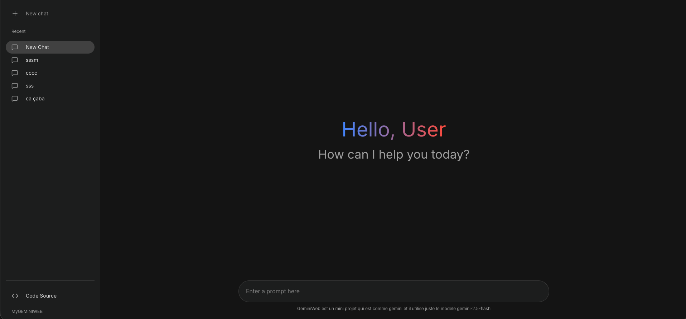
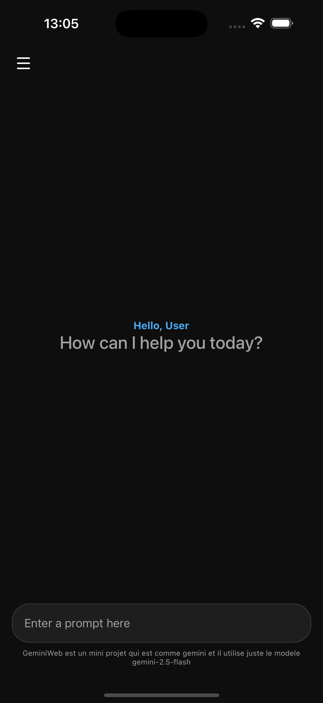

# MyGemini Project

Welcome to **MyGemini**, a comprehensive clone of the Google Gemini interface, available on both **Web** and **Mobile** platforms. This project demonstrates the integration of Google's AI models in a modern, user-friendly interface.

## 📂 Project Structure

This repository is a monorepo containing two distinct applications:

- **[MyGeminiWeb](./MyGeminiWeb)**: A responsive web application built with **React**, **Vite**, and **Material UI**.
- **[MyGeminiMobile](./MyGeminiMobile)**: A native mobile application built with **React Native** and **Expo**.

Both projects share the same design philosophy and core logic for interacting with the Gemini API.

## 📸 Screenshots

| **Web Interface** | **Mobile Interface** |
|:---:|:---:|
|  |  |

## 🔑 Getting Started: API Key

To run either the Web or Mobile application, you will need a valid **Google Gemini API Key**.

### How to generate a key:

1.  Go to **[Google AI Studio](https://aistudio.google.com/)**.
2.  Sign in with your Google account.
3.  Click on **"Get API key"** (usually on the top left or in the settings).
4.  Click **"Create API key"**.
5.  Copy the generated key string (it starts with `AIza...`).

### Configuration

Once you have your key, you will need to add it to the `.env` file of the project you want to run:

- **For Web**: Create `MyGeminiWeb/.env` and add `GEMINI_API_KEY=YOUR_KEY`
- **For Mobile**: Create `MyGeminiMobile/.env` and add `GEMINI_API_KEY=YOUR_KEY`

## 🚀 Running the Projects

Please refer to the specific `README.md` in each folder for detailed installation and startup instructions:

- [Web Instructions](./MyGeminiWeb/README.md)
- [Mobile Instructions](./MyGeminiMobile/README.md)

## 📄 License

This project is a side project for experience purposes.